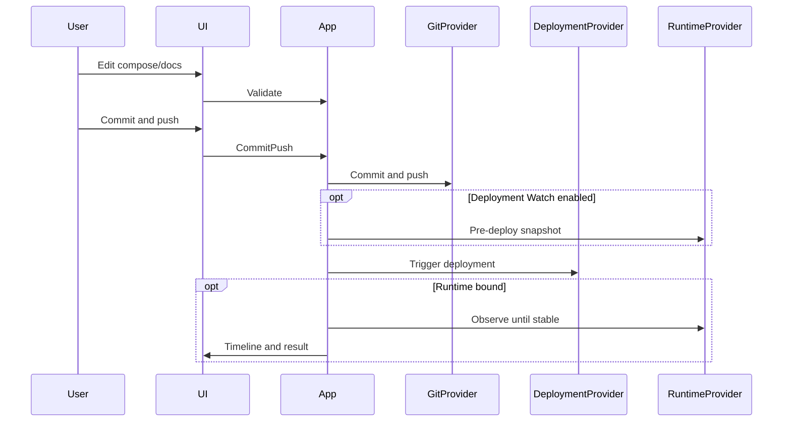
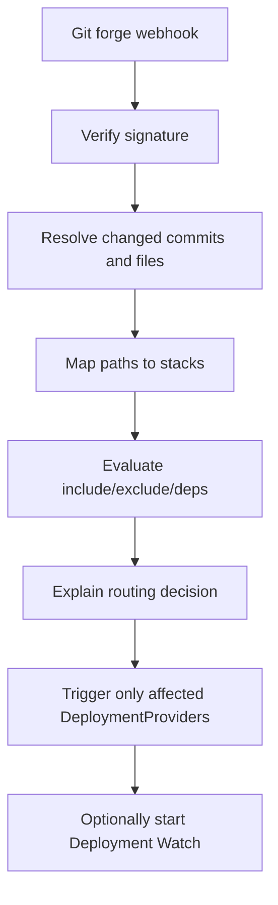

# Architecture overview

## Shape

**Modular monolith**, single long-running Node process, deployed via Docker Compose (or equivalent).

```text
┌─────────────────────────────────────────────────────────────┐
│                     stack-manager (Node)                      │
│  ┌──────────────┐  ┌──────────────┐  ┌────────────────────┐ │
│  │ Next.js UI   │  │ App routes / │  │ Background worker │ │
│  │ (App Router) │──│ server APIs  │──│ (same process)    │ │
│  └──────────────┘  └──────────────┘  └────────────────────┘ │
│           │                 │                    │           │
│           └──────────── domain services ─────────┘           │
│                             │                                │
│              persistence ports (Drizzle)                     │
│                             │                                │
│                    SQLite (MVP) / future PG                  │
└─────────────────────────────────────────────────────────────┘
         │              │               │              │
    Git forges    Deploy webhooks   Runtime APIs   Secret APIs
```

Not a separate frontend/API microservice split for MVP. Not serverless / not Vercel-shaped. Background webhook and Deployment Watch processing must be reliable in a long-running container.

## Layers

1. **UI** — source editing, stack overview, deploy/watch timelines, settings
2. **Application services** — Git workflow, routing, validation, watch orchestration
3. **Provider adapters** — Git / Deployment / Runtime / Secret (capability interfaces)
4. **Persistence** — Drizzle repositories behind ports; SQLite driver initially
5. **Jobs** — persisted job rows + in-process poller/worker (see ADR 0002)

## Core invariants

1. **Git is authoritative** for stack configuration.
2. **DeploymentProvider** only initiates deployment; it does not become runtime inventory UI.
3. **RuntimeProvider** is optional and read-only at the application boundary.
4. **Bindings are explicit** (`DeploymentBinding[]`, `RuntimeBinding[]`, secret bindings) — never inferred solely from folder names.
5. **Credentials** encrypted at rest; never returned to clients after save; redacted in logs/audit.
6. **No Containers / Images / Networks / Volumes** management pages in core navigation.

## High-level flows

### Edit → commit → deploy (interactive)



### Central Git push router (forge webhook)



## Provider capability model

Providers are registered by type and expose **capabilities**, not a god-interface.

| Provider family | Role | Required for MVP core? |
| --- | --- | --- |
| GitProvider | clone/fetch, read tree, commit, push, webhook verify | Yes |
| DeploymentProvider | trigger deploy, report acceptance | Optional per stack |
| RuntimeProvider | read-only runtime context | Optional |
| SecretProvider | metadata / existence / path binding | Optional |

Portainer is an **adapter**, not a core dependency.

## Persistence strategy

- Drizzle schema + migrations
- Domain services depend on **repository ports**, not SQLite SQL dialect features
- Document PostgreSQL upgrade path for larger/multi-user installs (connection pooling, concurrent writers, backup tooling)
- Job and audit tables live in the same database for MVP

## Editor

Prefer **CodeMirror 6** for Compose/YAML/Markdown editing with mobile as a first-class constraint. Monaco remains an evaluated alternative (ADR 0003) — do not choose it merely for “VS Code-like” aesthetics.

## Configuration surface (application)

Self-hosted env examples (names indicative):

- `STACK_MANAGER_DATA_DIR` — SQLite + working clones
- `STACK_MANAGER_ENCRYPTION_KEY` — credential encryption
- `STACK_MANAGER_SESSION_SECRET` — auth sessions
- Optional reverse-proxy / TLS terminated externally

No design around ephemeral serverless filesystem.

## Code layout (implemented in PR #2, extended through v0.5.0)

```text
src/
  instrumentation.ts        # server start: config (fail closed) → data dir → migrations → job worker
  app/                      # Next.js App Router: pages (server components) + thin API route handlers
    api/…/route.ts          # every handler wrapped by defineRoute (auth default-deny, origin check, zod)
    styles/                 # tokens.css → base.css → components.css → shell.css (no inline styles; lint-enforced)
  shared/source/            # pure path rules, secret-file policy, Compose/YAML analysis (server + browser)
  shared/git-*.ts           # Git workflow and history response contracts shared with the Changes/History UI
  ui/                       # UI components; may not import src/server/*
    primitives/             # Button, Alert, Section, PageHeader, Breadcrumbs, EmptyState, ConfirmButton, StatusPill
    shell/                  # signed-in app shell: sidebar (wide) / top bar + drawer (narrow)
    source/                 # stack editor (CodeMirror 6), file tree, docs, changes (commit/push), history, discovery
  server/
    config/                 # env parsing and validation
    domain/                 # entities, validation, errors — no framework/persistence imports
    application/            # services + persistence ports (ports.ts); depend on ports, not Drizzle
                            #   (GitWorkflowService: draft commit/push; GitHistoryService: stack-scoped history)
    persistence/            # Drizzle schema; sqlite/ adapters implement the ports
    providers/git/          # GitProvider interface, registry, hardened git CLI, isolated mutations, repository lock,
                            #   history reader
    jobs/                   # lease-based in-process worker (ADR 0002)
    security/               # AES-256-GCM secret box, Argon2id, session tokens, redaction, path + network policy
    observability/          # structured JSON logger (redacted)
    http/                   # route wrapper, cookies, origin checks, request schemas
    container.ts            # composition root (the only place services are constructed)
drizzle/                    # generated SQL migrations (applied at startup)
tests/                      # Vitest unit + integration tests; tests/e2e = Playwright + axe UI tests
```

Layer boundaries are enforced with ESLint `no-restricted-imports` (domain cannot import persistence, providers,
services or frameworks; services cannot import Drizzle/SQLite; client UI cannot import server modules).

Next.js compiles `instrumentation.ts` and route bundles separately. The container is therefore stored on
`globalThis`, and the HTTP boundary identifies application errors by a brand (`isAppError`) rather than
`instanceof`.

## Stopping rule

If implementation begins resembling a Docker host manager, re-read [PRODUCT.md](PRODUCT.md) and [adr/0005-product-boundary.md](adr/0005-product-boundary.md).
